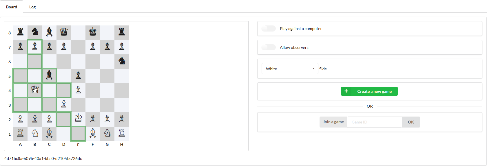

# EcheChess

 
EcheChess is a chess game made with spring boot + a rest service. The multiplayer is functional, but there's no AI yet.

I rely on the
<a href='http://www.ej-technologies.com/products/jprofiler/overview.html'>Java profiler from EJ Technologies</a>. 
 
Thanks also to JetBrains for providing a free subscription for their <a href='https://www.jetbrains.com/toolbox'>JetBrains Toolbox</a> (<a href='https://www.jetbrains.com/buy/opensource'>Free Open Source Licenses</a>). 
 
